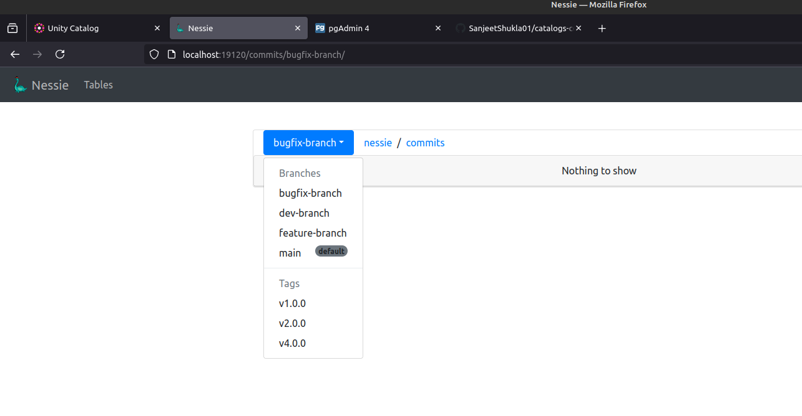
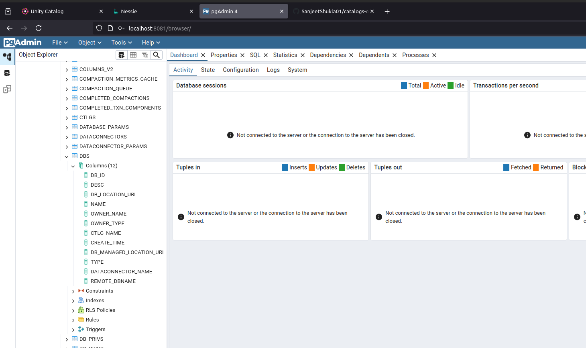

This Repo contains code local setup/prototype for following three catalogs
1. Unity Catalog
2. Nessie Catalog
3. Hive Catalog

### In order to run Unity Catalog Follow the instructions below:
1. Go to the `unity` directory
2. Run `bin/start-uc-server` This will start unity server
3. Now in another terminal window you can interact with Unity catalog
    - `bin/uc table list --catalog unity --schema default`
    - `bin/uc table get --full_name unity.default.numbers`
4. To run the Unity catalog UI:
   - `cd /ui`
   - `yarn install `
   - `yarn start`
Unity Catalog UI will be available at: http://localhost:3000

> 

> 

### In order to run Nessie Catalog:
1. Go to the `nessie` directory
2. Run `docker compose up -d` This will start unity server
3. Nessie Catalog UI will be available at: http://localhost:19120

> 

### In order to run Hive Catalog:
1. Go to the `hive` directory
2. Run `docker compose up -d` This will start Hive Metastore
3. Hive Metastore is used to store data about hive tables. 
3. Hive Metastore UI will be available at: http://localhost:8081

>